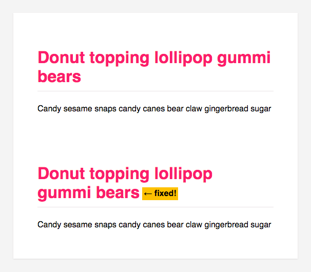

# widow [](https://travis-ci.org/ben-eb/widow) [](http://badge.fury.io/js/widow) [](https://gemnasium.com/ben-eb/widow)

> Add non breaking spaces to the ends of block level elements.

Install via [npm](https://npmjs.org/package/widow):

```
npm install widow --save
```

## Why?

To ensure good typographic style, widow adds non breaking spaces to your HTML content automatically. It's lightweight and doesn't depend on jQuery; and its node API will allow you to transform content on the server before it reaches the client.



In node, widow uses [cheerio](https://github.com/cheeriojs/cheerio) to modify a string of HTML; in the browser, it will modify the current document using `querySelectorAll`.

## Example (node)

```js
var widow = require('widow');
var htmlStr = '<h1>Donut topping lollipop gummi bears</h1>';

console.log(widow(htmlStr));
// => <h1>Donut topping lollipop gummi&nbsp;bears</h1>
```

## Example (browser)

Bundle this code with [browserify](https://github.com/substack/node-browserify):

```js
var widow = require('widow');
widow();
```

## API

### widow([html,][options])

The html argument is only required in node. In the browser it will modify the current `document`.

## Options

### selectors
Type: `Array`

Which selectors widow should transform. By default it only transforms headings, blockquotes, list items, paragraphs and table cells. Override this with an array of query selectors to limit widow's scope.

### maxLength
Type: `Integer`
Default: `50`

You can specify a maximum length at which widow should apply a non-breaking space - this is useful if you have headings with large font sizes, and you tend to use long words in them.

## Contributing

Pull requests are welcome. If you add functionality, then please add unit tests to cover it.

## License

MIT © Ben Briggs
